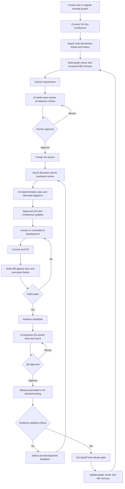
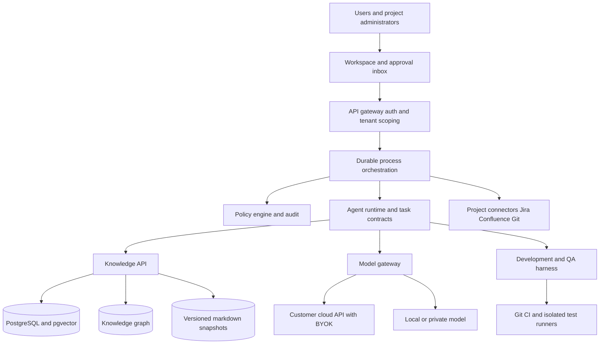
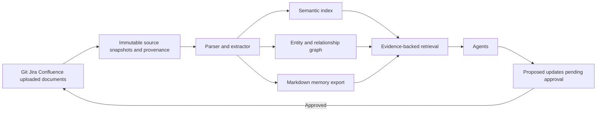

# AI Process Platform — Continuous SDLC → STLC Architecture

## 1. Product lifecycle

```mermaid
flowchart TD
 A[Create new or migrate existing project] --> B[Connect Git Jira Confluence]
 B --> C[Ingest code documents tickets and history]
 C --> D[Build graph vector and versioned MD memory]
 D --> E[Submit requirement]
 E --> F[AI drafts epics stories acceptance criteria]
 F --> G{Human approval}
 G -->|Revise| F
 G -->|Approve| H[Create Jira issues]
 H --> I[Sprint allocation and AI readiness review]
 I --> J[AI implementation plan and Mermaid diagrams]
 J --> K[Approved Jira and Confluence updates]
 K --> L[Human or controlled AI development]
 L --> M[Commit and PR]
 M --> N[Verify diff against story and executed checks]
 N --> O{Gates pass}
 O -->|No| L
 O -->|Yes| P[Release candidate]
 P --> Q[AI proposes QA stories tests and sprint]
 Q --> R{QA approval}
 R -->|Revise| Q
 R -->|Approve| S[Manual automated or AI-assisted testing]
 S --> T{Evidence satisfies criteria}
 T -->|No| U[Defect and development feedback]
 U --> I
 T -->|Yes| V[QA signoff and release gate]
 V --> W[Update graph vector and MD memory]
 W --> D
```

## 2. Control plane and execution

```mermaid
flowchart TB
 U[Users and project administrators] --> UI[Workspace and approval inbox]
 UI --> API[API gateway auth and tenant scoping]
 API --> WF[Durable process orchestration]
 WF --> PL[Policy engine and audit]
 WF --> AG[Agent runtime and task contracts]
 AG --> KG[Knowledge API]
 KG --> DB[(PostgreSQL and pgvector)]
 KG --> GR[(Knowledge graph)]
 KG --> MD[(Versioned markdown snapshots)]
 AG --> MG[Model gateway]
 MG --> CL[Customer cloud API with BYOK]
 MG --> LC[Local or private model]
 AG --> TH[Development and QA harness]
 TH --> GIT[Git CI and isolated test runners]
 WF --> J[Project connectors Jira Confluence Git]
```

## 3. Source of truth and memory

```mermaid
flowchart LR
 SRC[Git Jira Confluence uploaded documents] --> RAW[Immutable source snapshots and provenance]
 RAW --> IX[Parser and extractor]
 IX --> V[Semantic index]
 IX --> G[Entity and relationship graph]
 IX --> M[Markdown memory export]
 V --> R[Evidence-backed retrieval]
 G --> R
 M --> R
 R --> A[Agents]
 A --> REV[Proposed updates pending approval]
 REV -->|Approved| SRC
```
