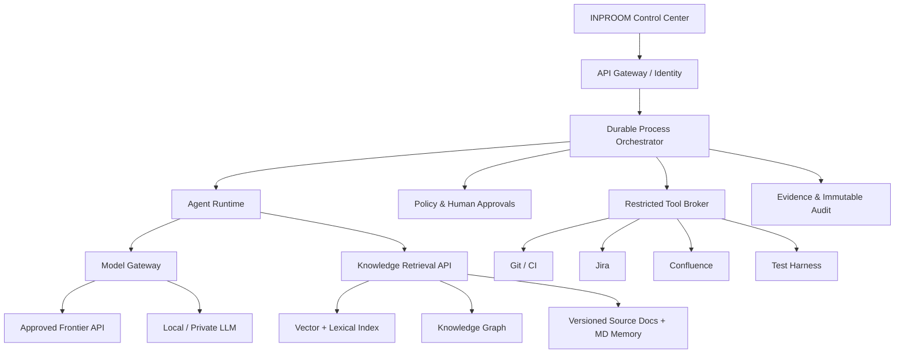
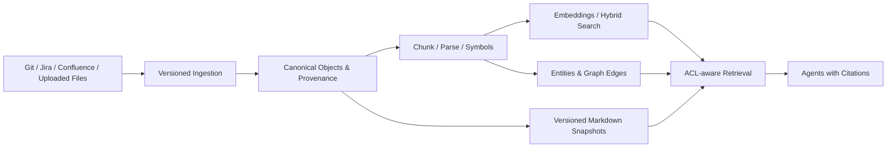
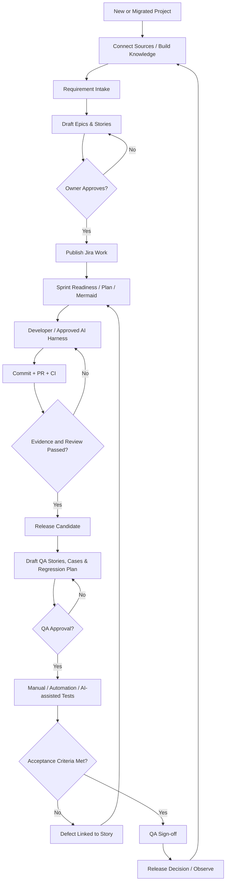
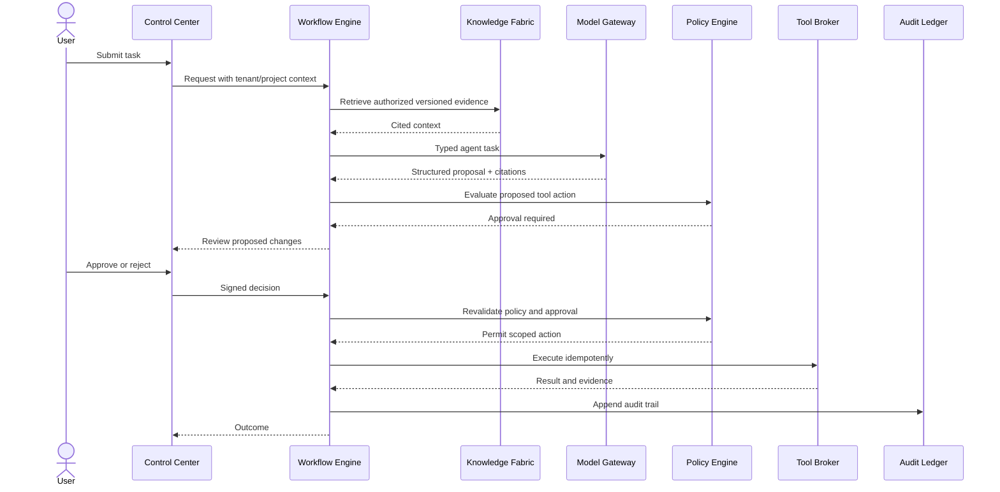
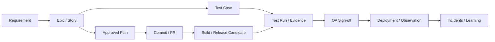

# INPROOM — Editable Mermaid Diagrams

## Platform architecture

```mermaid
flowchart TB
  UI["INPROOM Control Center"] --> API["API Gateway / Identity"]
  API --> WF["Durable Process Orchestrator"]
  WF --> AG["Agent Runtime"]
  WF --> POLICY["Policy & Human Approvals"]
  AG --> MG["Model Gateway"]
  MG --> CLOUD["Approved Frontier API"]
  MG --> LOCAL["Local / Private LLM"]
  AG --> KB["Knowledge Retrieval API"]
  KB --> V["Vector + Lexical Index"]
  KB --> G["Knowledge Graph"]
  KB --> DOC["Versioned Source Docs + MD Memory"]
  WF --> TOOLS["Restricted Tool Broker"]
  TOOLS --> GIT["Git / CI"]
  TOOLS --> JIRA["Jira"]
  TOOLS --> CONF["Confluence"]
  TOOLS --> QA["Test Harness"]
  WF --> AUD["Evidence & Immutable Audit"]
```

## Source-to-knowledge projections

```mermaid
flowchart LR
  SRC["Git / Jira / Confluence / Uploaded Files"] --> ING["Versioned Ingestion"]
  ING --> STORE["Canonical Objects & Provenance"]
  STORE --> CHUNK["Chunk / Parse / Symbols"]
  CHUNK --> EMB["Embeddings / Hybrid Search"]
  CHUNK --> GRAPH["Entities & Graph Edges"]
  STORE --> MD["Versioned Markdown Snapshots"]
  EMB --> RET["ACL-aware Retrieval"]
  GRAPH --> RET
  MD --> RET
  RET --> AG["Agents with Citations"]
```

## SDLC ↔ STLC control flow

```mermaid
flowchart TD
  NEW["New or Migrated Project"] --> SYNC["Connect Sources / Build Knowledge"]
  SYNC --> REQ["Requirement Intake"]
  REQ --> DRAFT["Draft Epics & Stories"]
  DRAFT --> APPROVE{"Owner Approves?"}
  APPROVE -->|No| DRAFT
  APPROVE -->|Yes| JIRA["Publish Jira Work"]
  JIRA --> PLAN["Sprint Readiness / Plan / Mermaid"]
  PLAN --> DEV["Developer / Approved AI Harness"]
  DEV --> PR["Commit + PR + CI"]
  PR --> CHECK{"Evidence and Review Passed?"}
  CHECK -->|No| DEV
  CHECK -->|Yes| RC["Release Candidate"]
  RC --> QAD["Draft QA Stories, Cases & Regression Plan"]
  QAD --> QAG{"QA Approval?"}
  QAG -->|No| QAD
  QAG -->|Yes| RUN["Manual / Automation / AI-assisted Tests"]
  RUN --> DONE{"Acceptance Criteria Met?"}
  DONE -->|No| BUG["Defect Linked to Story"]
  BUG --> PLAN
  DONE -->|Yes| SIGN["QA Sign-off"]
  SIGN --> REL["Release Decision / Observe"]
  REL --> SYNC
```

## Controlled agent execution

```mermaid
sequenceDiagram
  actor User
  participant UI as Control Center
  participant WF as Workflow Engine
  participant KB as Knowledge Fabric
  participant AI as Model Gateway
  participant P as Policy Engine
  participant T as Tool Broker
  participant A as Audit Ledger
  User->>UI: Submit task
  UI->>WF: Request with tenant/project context
  WF->>KB: Retrieve authorized versioned evidence
  KB-->>WF: Cited context
  WF->>AI: Typed agent task
  AI-->>WF: Structured proposal + citations
  WF->>P: Evaluate proposed tool action
  P-->>WF: Approval required
  WF-->>UI: Review proposed changes
  User->>UI: Approve or reject
  UI->>WF: Signed decision
  WF->>P: Revalidate policy and approval
  P-->>WF: Permit scoped action
  WF->>T: Execute idempotently
  T-->>WF: Result and evidence
  WF->>A: Append audit trail
  WF-->>UI: Outcome
```

## Knowledge traceability

```mermaid
flowchart LR
  R["Requirement"] --> E["Epic / Story"]
  E --> PL["Approved Plan"]
  PL --> C["Commit / PR"]
  C --> B["Build / Release Candidate"]
  E --> TC["Test Case"]
  TC --> TR["Test Run / Evidence"]
  B --> TR
  TR --> SG["QA Sign-off"]
  SG --> DEP["Deployment / Observation"]
  DEP --> INC["Incidents / Learning"]
```
